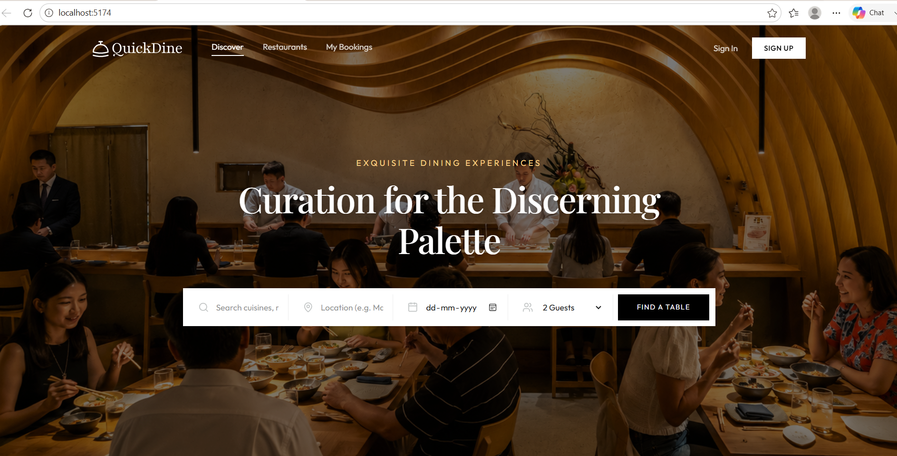
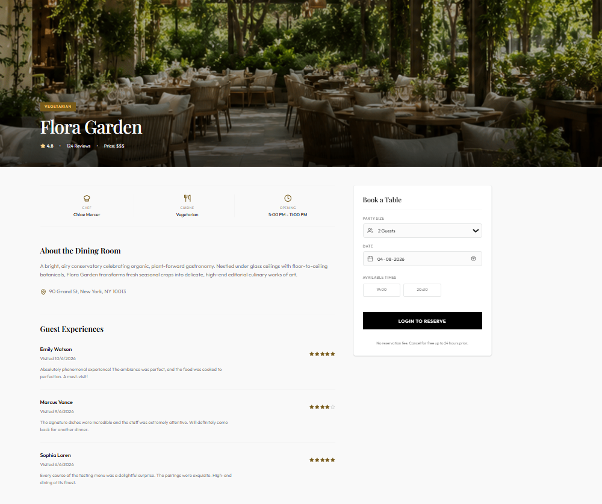
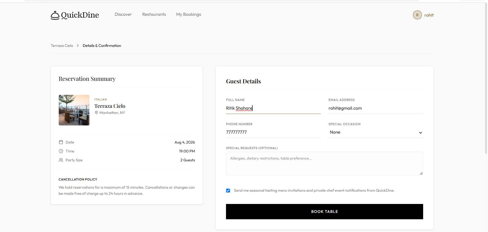
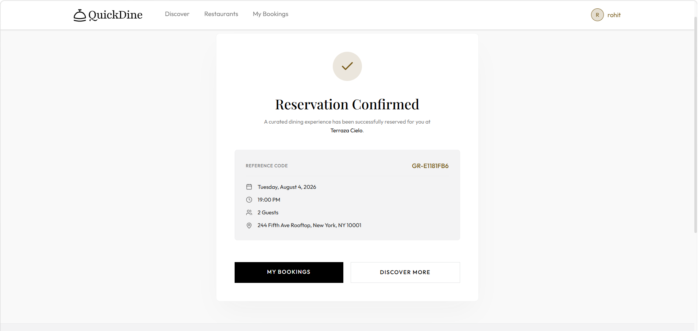
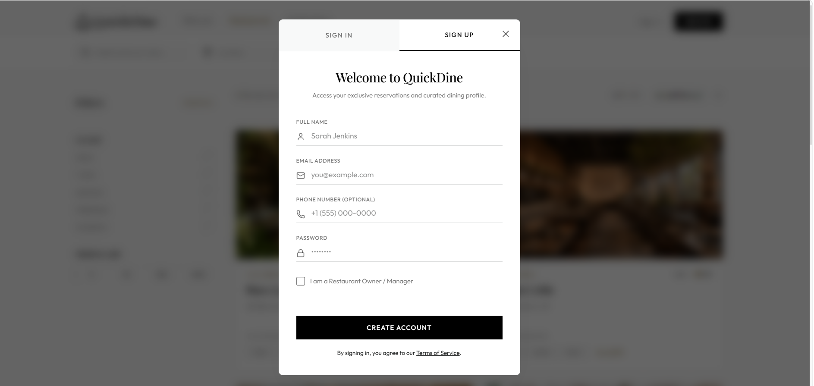

# 🍽️ QuickDine - Restaurant Booking Platform

QuickDine is a full-stack Restaurant Booking Platform where users can browse restaurants, book tables, and restaurant owners can manage their restaurants and bookings.

---

## 🚀 Features

- 🔐 User Authentication (JWT)
- 🍴 Browse Restaurants
- 📖 Restaurant Details
- 🪑 Book Table
- ✅ Booking Confirmation
- 👨‍🍳 Owner Dashboard
- 🏪 Restaurant Management
- 📱 Responsive Design

---

## 🛠️ Tech Stack

### Frontend
- React.js
- TypeScript
- Vite
- Tailwind CSS
- Axios

### Backend
- Node.js
- Express.js
- MongoDB
- Mongoose
- JWT Authentication
- Cloudinary

---

# 📸 Project Screenshots

## 🏠 Home Page



---

## 🍽️ Restaurant Listing


---

## 📖 Restaurant Details



---

## 🪑 Book Table



---

## ✅ Booking Confirmation



---

## 🔐 Sign Up Page



---

# ⚙️ Installation

```bash
git clone https://github.com/ritikshahare26/Restaurant_Booking_platform.git
```

```bash
cd Restaurant_Booking_platform
```

### Backend

```bash
cd server
npm install
npm run server
```

### Frontend

```bash
cd Client
npm install
npm run dev
```

---

# 👨‍💻 Author

**Ritik Shahare**

- GitHub: https://github.com/ritikshahare26
- LinkedIn: https://www.linkedin.com/in/ritik-shahare-b1b2a5399/

---

⭐ If you like this project, don't forget to Star the repository.